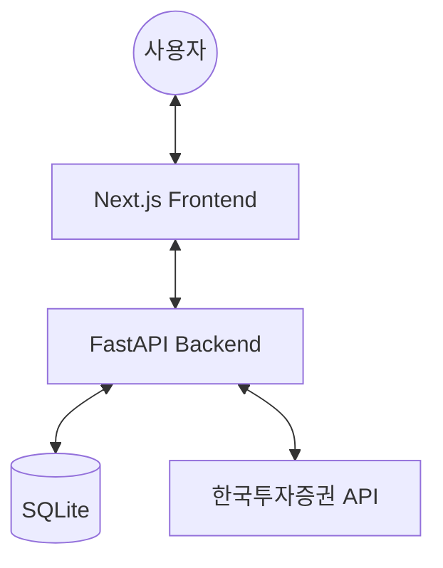

# 🏦 Family Asset Manager (FAM)

가족 자산을 안전하고 스마트하게 관리하기 위한 **API-First 자산 관리 플랫폼**입니다. 한국투자증권(KIS) API를 기반으로 자산 조회, 리밸런싱 분석, 그리고 다양한 매매 전략(분할 매매, 그리드 매매 등)을 제공합니다.

---

## 🚀 주요 기능 (Key Features)

- **통합 자산 대시보드**: 여러 계좌의 자산을 실시간으로 조회하고 한눈에 파악.
- **포트폴리오 리밸런싱**: 목표 비중과 현재 상태를 비교하여 최적의 매매 제안.
- **스마트 트레이딩**: 
  - **Grid Trading**: 지정된 가격 간격으로 분할 매수/매도 실행.
  - **Daily Split**: 여러 날에 걸쳐 자동으로 분할 매매 예약.
- **보안 중심 설계**: API 키 및 민감 정보를 AES-256 방식으로 암호화하여 DB 저장.
- **프리미엄 UI/UX**: Next.js와 TailwindCSS를 기반으로 한 현대적이고 직관적인 다크 모드 UI.

## 🏗 아키텍처 (Architecture)



- **Backend**: FastAPI (Python) - 토큰 관리, 주문 프록시, 스케줄러.
- **Frontend**: Next.js (TypeScript) - 상태 관리 및 UI 렌더링.
- **Database**: SQLite - 계좌 정보, 타겟 포트폴리오, 예약 주문 기록.

## 🛠 시작하기 (Getting Started)

### 1. 환경 변수 설정
루트 디렉토리에 `.env` 파일을 작성합니다.
```env
ENCRYPTION_KEY=your_base64_encryption_key
# DB 및 기타 설정은 기본값 사용 가능
```

### 2. 백엔드 실행
```bash
cd backend
python -m venv venv
source venv/bin/activate
pip install -r requirements.txt
python -m uvicorn app.main:app --reload
```

### 3. 프론트엔드 실행
```bash
cd frontend
npm install
npm run dev
```

### 4. 관리 도구 사용
```bash
./manage.sh restart  # 서비스 재시작
./manage.sh logs frontend  # 로그 확인
```

## 📂 프로젝트 구조 (Structure)

- `backend/`: FastAPI 서버 로직 및 데이터 모델.
- `frontend/`: Next.js 웹 애플리케이션.
- `docs/`: 기술 문서 및 DB 설계서.
- `scripts/`: DB 초기화 및 관리용 유틸리티 스크립트.

---
Developed with 💙 by Antigravity & User.
